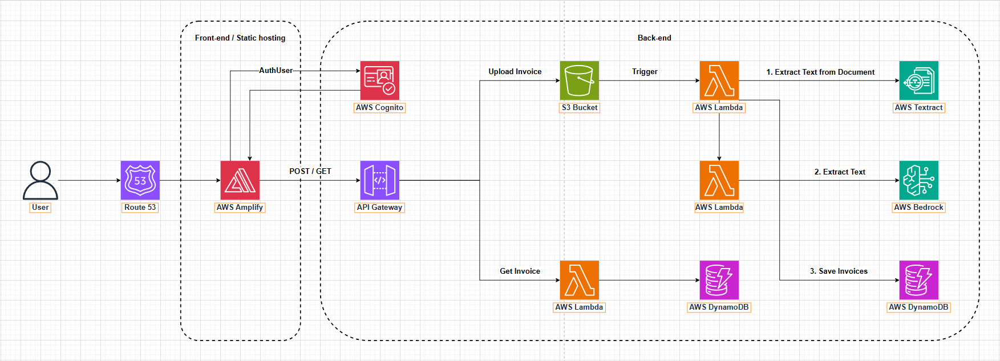

# 🧾 AI Invoice Scanner – Giải pháp tự động hóa trích xuất và phân tích hóa đơn bằng trí tuệ nhân tạo trên nền tảng AWS

> 🔍 *Một hệ thống thông minh giúp doanh nghiệp tự động thu nhận, trích xuất dữ liệu từ hóa đơn đầu vào (dạng ảnh/PDF), phân tích nội dung bằng AI, và lưu trữ thông tin có cấu trúc vào cơ sở dữ liệu – tất cả được triển khai trên kiến trúc serverless của AWS, tận dụng sức mạnh của Amazon Textract, Bedrock và các dịch vụ đám mây hiện đại.*

---

## 📝 Tóm tắt dự án
Trong bối cảnh chuyển đổi số diễn ra mạnh mẽ, việc tự động hóa quy trình xử lý hóa đơn đầu vào đang trở thành nhu cầu thiết yếu của nhiều doanh nghiệp. Các hóa đơn thường tồn tại ở dạng ảnh, PDF hoặc bản scan không có cấu trúc, gây khó khăn trong việc trích xuất, lưu trữ và kiểm tra dữ liệu. Việc nhập liệu thủ công không chỉ tốn thời gian mà còn dễ xảy ra sai sót, ảnh hưởng đến độ chính xác trong kế toán và kiểm toán.

**AI Invoice Scanner** được xây dựng nhằm giải quyết bài toán này thông qua một hệ thống xử lý hóa đơn tự động dựa trên trí tuệ nhân tạo (AI) và nền tảng đám mây AWS. Giải pháp cho phép người dùng tải lên hóa đơn dưới dạng ảnh hoặc PDF, sử dụng **Amazon Textract** để trích xuất văn bản, và **Amazon Bedrock (Titan/Claude)** để phân tích ngữ nghĩa, nhận diện các trường thông tin quan trọng như: số hóa đơn, ngày phát hành, mã số thuế, đơn vị bán hàng, danh sách mặt hàng, tổng tiền, v.v.

Toàn bộ thông tin trích xuất được lưu vào **Amazon DynamoDB**, cho phép truy xuất nhanh và hỗ trợ đối soát dễ dàng. Hệ thống được triển khai theo kiến trúc **serverless** với các dịch vụ chủ đạo như **AWS Lambda**, **S3**, **API Gateway**, **Cognito** và **Amplify**, đảm bảo khả năng mở rộng linh hoạt, vận hành ổn định và tiết kiệm chi phí.
Đối tượng sử dụng gồm các doanh nghiệp vừa và nhỏ, bộ phận kế toán, công ty kiểm toán và các tổ chức cần xử lý lượng lớn hóa đơn. Giao diện người dùng trực quan được xây dựng bằng **React + Amplify**, giúp cả người không chuyên cũng dễ dàng sử dụng.

### 🎯 Lợi ích nổi bật:
- **Tiết kiệm thời gian & chi phí**: Tự động hóa hoàn toàn quy trình nhập liệu.
- **Tăng độ chính xác**: Giảm thiểu lỗi do con người.
- **Dễ truy xuất & kiểm soát**: Nhờ lưu trữ dữ liệu có cấu trúc trong DynamoDB.
- **Bảo mật cao**: Tích hợp xác thực người dùng qua Amazon Cognito.
- **Dễ mở rộng**: Có thể tích hợp với ERP, CRM hoặc dashboard BI.

Với sự kết hợp giữa AI và nền tảng AWS, dự án không chỉ mang tính thực tiễn cao mà còn mở rộng tiềm năng ứng dụng trong nhiều lĩnh vực như kế toán – tài chính, bán lẻ, logistics và dịch vụ công.

---

## ❗ 1. Tuyên bố vấn đề

### 🧾 Tình hình hiện tại

Hiện nay, phần lớn doanh nghiệp vừa và nhỏ (SME) tại Việt Nam vẫn xử lý hóa đơn đầu vào theo phương pháp thủ công, dù đã áp dụng hóa đơn điện tử. Mỗi ngày, doanh nghiệp tiếp nhận từ **16–33 hóa đơn** với định dạng đa dạng như giấy, ảnh chụp, hoặc PDF. Kế toán viên phải mở file, đọc thủ công các trường như số hóa đơn, ngày phát hành, nhà cung cấp, thuế GTGT..., rồi nhập tay vào phần mềm kế toán – mất trung bình **~3 phút mỗi hóa đơn**.

Quy trình này không chỉ tốn nhiều thời gian mà còn tiềm ẩn tỷ lệ sai sót **10–15%** (KPMG, 2023), gây khó khăn trong tra cứu, đối soát và kiểm toán nội bộ. Mặc dù 100% doanh nghiệp đã dùng hóa đơn điện tử từ 2022 (Tổng cục Thuế), nhưng vẫn thiếu công cụ hỗ trợ tự động hóa toàn diện.

➡️ **Nhu cầu cấp thiết**: Một giải pháp có khả năng **tiếp nhận đa định dạng**, **trích xuất thông minh**, **tích hợp linh hoạt**, giúp giảm gánh nặng vận hành và nâng cao hiệu quả kế toán.

### ⚠️ Những thách thức chính

1. **Định dạng hóa đơn không đồng nhất**: Tồn tại dưới nhiều dạng (ảnh mờ, scan, PDF khóa bảo vệ...) khiến các công cụ thông thường không thể đọc tự động.
2. **Khối lượng xử lý lớn & lặp lại**: Hàng trăm – nghìn hóa đơn mỗi tháng gây quá tải cho nhân sự kế toán.
3. **Tỷ lệ lỗi nhập liệu cao**: Lỗi do con người dễ xảy ra, ảnh hưởng đến báo cáo tài chính và tuân thủ thuế.
4. **Khó tra cứu & đối chiếu**: Dữ liệu không cấu trúc gây khó khăn khi kiểm toán hoặc tìm kiếm.
5. **Khó tích hợp hệ thống kế toán/ERP**: Các công cụ xử lý thường hoạt động độc lập, không có khả năng tích hợp.
6. **Yêu cầu bảo mật ngày càng cao**: Dữ liệu tài chính nhạy cảm đòi hỏi xử lý và lưu trữ theo chuẩn bảo mật (VD: GDPR, luật ATTT).

### 👥 Tác động đến các bên liên quan

| Bên liên quan | Tác động |
|---------------|----------|
| **Kế toán – Tài chính** | Quá tải công việc lặp lại, dễ sai sót, năng suất thấp |
| **Kiểm toán nội bộ** | Khó kiểm tra, đánh giá rủi ro do dữ liệu không tổ chức |
| **Ban điều hành** | Dữ liệu thiếu minh bạch gây ảnh hưởng quyết định chiến lược |
| **Nhà cung cấp & khách hàng** | Gặp chậm trễ thanh toán, đối chiếu sai lệch, giảm uy tín |
| **Bộ phận CNTT** | Gặp khó khi tích hợp quy trình thủ công vào hệ thống số hóa |
| **Cơ quan quản lý** | Dữ liệu không truy vết rõ ràng → rủi ro vi phạm pháp luật |

### 💥 Hệ quả kinh doanh nếu không giải quyết

- 💸 **Tăng chi phí vận hành**: Nhân sự làm việc lặp đi lặp lại, chi phí cao nhưng hiệu quả thấp.
- 🧯 **Tăng rủi ro pháp lý**: Nhập liệu sai dễ gây sai lệch sổ sách, báo cáo tài chính.
- ⏳ **Giảm khả năng ra quyết định**: Thiếu dữ liệu tức thời, chính xác.
- 🤝 **Mất lòng tin đối tác**: Lỗi trong thanh toán – đối chiếu ảnh hưởng đến mối quan hệ kinh doanh.
- 🐢 **Cản trở chuyển đổi số**: Là điểm nghẽn nếu không tự động hóa kịp thời.
- 📉 **Mất lợi thế cạnh tranh**: Doanh nghiệp lạc hậu hơn đối thủ áp dụng công nghệ AI.

---

## 🏗️ 2. Kiến trúc giải pháp

### 🧩 Tổng quan kiến trúc

Hệ thống **AI Invoice Scanner** được xây dựng hoàn toàn trên kiến trúc **Serverless** của AWS. Thiết kế theo hướng **event-driven**, tự động hóa luồng xử lý: **tải hóa đơn → trích xuất → phân tích → lưu trữ → truy xuất**, giúp loại bỏ hoàn toàn máy chủ vật lý, chi phí linh hoạt theo mức sử dụng và dễ dàng mở rộng.

#### 🎯 Mục tiêu thiết kế kiến trúc
- Tự động hóa toàn bộ quy trình xử lý hóa đơn.
- Tận dụng Textract và Bedrock để trích xuất dữ liệu phi cấu trúc.
- Xác thực người dùng bảo mật với Amazon Cognito.
- Tối ưu chi phí vận hành thông qua mô hình serverless.
- Đảm bảo mở rộng linh hoạt, dễ bảo trì, không phụ thuộc hạ tầng máy chủ.

### 🔄 Luồng xử lý dữ liệu

Quy trình xử lý hóa đơn trong hệ thống AI Invoice Scanner diễn ra theo các bước tuần tự như sau:

1. **Người dùng truy cập hệ thống** thông qua một địa chỉ domain (được cấu hình bằng Route 53). Giao diện người dùng được triển khai bằng ReactJS và lưu trữ trên AWS Amplify.

2. **Người dùng đăng nhập hoặc đăng ký tài khoản** thông qua Amazon Cognito. Hệ thống sử dụng token xác thực JWT để kiểm soát quyền truy cập và bảo vệ API.

3. **Khi người dùng tải lên một hóa đơn (POST request)**:
   - File hóa đơn (PDF hoặc ảnh) được gửi qua API Gateway và lưu trữ tạm thời vào Amazon S3.
   - Sau khi lưu thành công, S3 tự động kích hoạt một hàm Lambda.
   - Lambda này sẽ lần lượt thực hiện các tác vụ:
     - Gọi **Amazon Textract** để trích xuất văn bản và cấu trúc (bảng, biểu mẫu) từ hóa đơn.
     - Gửi kết quả OCR sang **Amazon Bedrock**, nơi mô hình AI như Titan hoặc Claude sẽ phân tích ngữ nghĩa và xác định các trường thông tin quan trọng như: số hóa đơn, ngày phát hành, mã số thuế, tổng tiền, danh sách sản phẩm,...
     - Dữ liệu được chuẩn hóa và lưu trữ có cấu trúc vào **Amazon DynamoDB** để phục vụ truy xuất nhanh sau này.

4. **Khi người dùng muốn truy xuất các hóa đơn đã xử lý (GET request)**:
   - Giao diện gửi yêu cầu GET đến API Gateway, sau đó chuyển tiếp đến một Lambda khác.
   - Lambda này sẽ truy vấn dữ liệu từ DynamoDB dựa trên thông tin người dùng và ID hóa đơn.
   - Kết quả truy xuất được trả về frontend để hiển thị cho người dùng một cách trực quan.

Quy trình này hoàn toàn tự động, sự kiện kích hoạt theo mô hình event-driven, đảm bảo xử lý nhanh chóng, chính xác và tiết kiệm tài nguyên vận hành.

### 🧱 Các khối chức năng chính

Hệ thống được tổ chức thành nhiều lớp chức năng độc lập, mỗi lớp đảm nhiệm một vai trò cụ thể:

- **Frontend Layer**  
  Giao diện người dùng xây dựng bằng ReactJS, triển khai qua AWS Amplify, cho phép người dùng tải hóa đơn, xem kết quả, đăng nhập và tương tác hệ thống một cách trực quan.

- **Auth Layer (Amazon Cognito)**  
  Cung cấp khả năng đăng ký, đăng nhập, xác thực bằng JWT token và phân quyền người dùng. Dữ liệu người dùng được quản lý trong User Pool.

- **API Gateway Layer**  
  Đóng vai trò là điểm giao tiếp giữa frontend và backend. Hỗ trợ định tuyến request đến các Lambda functions, xác thực token Cognito, logging và giới hạn truy cập (rate limiting).

- **Processing Layer**  
  Gồm 2 Lambda chính:
  - Lambda #1 xử lý tác vụ upload: Kích hoạt bởi S3 event, gọi Textract → Bedrock → lưu kết quả vào DynamoDB.
  - Lambda #2 xử lý truy vấn: Đáp ứng yêu cầu GET từ frontend để trả về dữ liệu hóa đơn đã xử lý.

- **AI Processing Layer**  
  Gồm:
  - Amazon Textract: Thực hiện nhận diện và trích xuất nội dung từ hóa đơn (OCR).
  - Amazon Bedrock: Phân tích ngữ nghĩa nội dung từ Textract để phân loại trường dữ liệu như mã số thuế, số tiền, ngày, v.v.

- **Storage Layer**  
  - Amazon S3: Lưu trữ file gốc (PDF, hình ảnh) do người dùng tải lên.
  - Amazon DynamoDB: Lưu kết quả trích xuất ở dạng JSON có cấu trúc, truy xuất nhanh chóng theo user và invoice ID.
    
### 🧰 Các dịch vụ AWS được sử dụng

| Dịch vụ         | Vai trò chính                          | Ghi chú                                                                 |
|------------------|------------------------------------------|------------------------------------------------------------------------|
| **Amazon S3**     | Lưu trữ hóa đơn đầu vào                 | Tự động kích hoạt Lambda khi có file mới                              |
| **AWS Lambda**    | Xử lý nghiệp vụ                        | Serverless, không cần vận hành máy chủ                                |
| **Amazon Textract** | OCR nội dung từ hóa đơn                 | Nhận diện văn bản, bảng biểu, form và bố cục                           |
| **Amazon Bedrock** | Phân tích ngữ nghĩa & gán nhãn dữ liệu | Dùng model Titan hoặc Claude để phân tích logic ngữ cảnh               |
| **Amazon DynamoDB**| Cơ sở dữ liệu lưu kết quả xử lý       | Truy vấn nhanh với cấu trúc key-value, mở rộng không giới hạn          |
| **API Gateway**   | Định tuyến HTTP giữa frontend ↔ backend | Có tích hợp xác thực Cognito và logging                                |
| **AWS Amplify**   | Hosting ứng dụng frontend ReactJS      | Tích hợp CI/CD, Cognito, API Gateway                                  |
| **Amazon Cognito**| Xác thực và phân quyền người dùng     | Hỗ trợ đăng nhập bằng JWT, OAuth2                                     |
| **Route 53**      | Cung cấp tên miền và DNS               | Hỗ trợ HTTPS, SSL/TLS, có thể tích hợp CloudFront để tăng tốc tải     |

### 🧬 Thiết kế các thành phần

#### 1. Giao diện người dùng (ReactJS + Amplify)
- Hiển thị danh sách hóa đơn, nút tải lên file, xem kết quả đã xử lý.
- Tích hợp xác thực người dùng từ Cognito và giao tiếp API Gateway để thực hiện các thao tác POST/GET.

#### 2. Xác thực và phân quyền (Amazon Cognito)
- Cung cấp chức năng đăng ký, đăng nhập, reset mật khẩu.
- Quản lý user pool, tạo và xác minh JWT token.
- Phân quyền truy cập tài nguyên API và dữ liệu người dùng.

#### 3. API Gateway
- Nhận request từ frontend và định tuyến đến Lambda tương ứng.
- Kết hợp authorizer của Cognito để bảo vệ endpoint.
- Hỗ trợ logging, throttling, CORS và kiểm soát phiên bản API.

#### 4. AWS Lambda
- Lambda #1:
  - Nhận event từ S3 khi người dùng tải lên file.
  - Gọi Textract để OCR.
  - Gửi kết quả OCR đến Bedrock để phân tích.
  - Chuẩn hóa dữ liệu và lưu vào DynamoDB.
- Lambda #2:
  - Nhận request từ API Gateway.
  - Truy vấn DynamoDB theo user và invoice ID.
  - Trả dữ liệu về frontend.

#### 5. AI Processing Layer (Textract + Bedrock)
- **Textract**: Đọc được bố cục tài liệu, bảng biểu, trường form; hỗ trợ tốt cho hóa đơn đa định dạng.
- **Bedrock**: Phân tích nội dung OCR để xác định các trường dữ liệu có ngữ nghĩa như mã số thuế, đơn vị bán hàng, tổng tiền.

#### 6. Lưu trữ hóa đơn và dữ liệu
- **S3**: Lưu trữ hóa đơn gốc (PDF, JPG, PNG).
- **DynamoDB**: Lưu kết quả phân tích ở dạng document JSON. Có thể truy vấn theo user ID, invoice ID hoặc ngày upload.

#### 7. Tên miền và DNS (Route 53)
- Định tuyến subdomain riêng (VD: `scanner.yourdomain.com`) đến frontend.
- Có thể kết hợp với CloudFront để cải thiện tốc độ và bảo mật HTTPS.

#### 8. Giám sát và mở rộng (optional)
- **CloudWatch**: Ghi log, cảnh báo khi Lambda lỗi hoặc quá tải.
- **AWS X-Ray**: Truy vết hoạt động Lambda theo dòng thời gian để tối ưu hiệu năng.

### 🔐 Kiến trúc bảo mật

- **Amazon Cognito**: Quản lý người dùng, xác thực và phân quyền bằng JWT.
- **IAM Roles**: Thiết lập quyền tối thiểu cho Lambda, S3, DynamoDB.
- **Mã hóa dữ liệu**:
  - **At rest**: Dữ liệu trên S3 và DynamoDB được mã hóa bằng KMS.
  - **In transit**: Tất cả kết nối sử dụng HTTPS/TLS để đảm bảo bảo mật truyền tải.
- **API Gateway**:
  - Xác thực bằng Cognito Authorizer.
  - Giới hạn tần suất truy cập (rate limiting).
  - Ghi log và phân tích truy cập bất thường.
- **Tường lửa ứng dụng web (WAF)** *(optional)*:
  - Bảo vệ khỏi các tấn công như SQLi, XSS, brute force.
- **CloudTrail & CloudWatch**:
  - Theo dõi toàn bộ hoạt động truy cập hệ thống.
  - Hỗ trợ truy vết điều tra sự cố và tuân thủ pháp lý.

### 📈 Thiết kế khả năng mở rộng

#### Theo số lượng hóa đơn
- Lambda có thể xử lý hàng nghìn sự kiện song song.
- Textract và Bedrock có thể chạy theo lô (batch) hoặc song song nhiều yêu cầu.
- DynamoDB và S3 mở rộng không giới hạn theo vùng và dung lượng.

#### Theo số lượng người dùng
- Cognito hỗ trợ mở rộng tới hàng triệu người dùng.
- Amplify và API Gateway tự động scale theo traffic người dùng.

#### Theo loại hóa đơn & nghiệp vụ
- Có thể huấn luyện Bedrock để hỗ trợ thêm các mẫu hóa đơn chuyên biệt.
- Hỗ trợ thêm nhận dạng mã QR, chữ ký số, hoặc phân loại theo lĩnh vực (logistics, y tế, tài chính...).

#### Theo khu vực địa lý
- Dễ dàng triển khai frontend multi-region nhờ Route 53.
- Sử dụng DynamoDB Global Tables để đồng bộ dữ liệu giữa các khu vực.

#### Tích hợp hệ thống bên ngoài
- Hệ thống có thể kết nối:
  - Phần mềm kế toán (MISA, Fast, Bravo...)
  - Hệ thống ERP nội bộ
  - Dashboard phân tích (Amazon QuickSight, Tableau, PowerBI)
  - Trợ lý ảo hoặc chatbot AI hỗ trợ kế toán

#### Chiến lược mở rộng trong tương lai
- Xây dựng ứng dụng mobile (React Native, Flutter).
- Giao diện riêng cho kiểm toán viên/ban giám đốc.
- Bổ sung AI chatbot hỗ trợ truy vấn hóa đơn bằng ngôn ngữ tự nhiên.

---

## ⚙️ 3. Triển khai kỹ thuật

Phần này trình bày chi tiết kế hoạch hiện thực hóa giải pháp AI Invoice Scanner từ khía cạnh kỹ thuật, bao gồm quy trình triển khai theo từng giai đoạn, yêu cầu công nghệ, phương pháp phát triển, chiến lược kiểm thử và kế hoạch đưa hệ thống vào vận hành. Mục tiêu là đảm bảo chất lượng, giảm thiểu rủi ro và tối ưu hóa tiến độ.

### 📌 Các Giai Đoạn Triển Khai

Giải pháp được xây dựng theo mô hình Agile, chia thành các Sprint 1–2 tuần, lặp lại theo chu kỳ kiểm thử – cải tiến. Dưới đây là các giai đoạn chính:

🔹 **Giai đoạn 1: Thiết kế & chuẩn bị hạ tầng**
- Thu thập yêu cầu kỹ thuật và chức năng từ stakeholders.
- Thiết lập các dịch vụ AWS: S3, DynamoDB, Lambda, Textract, Bedrock, Cognito, API Gateway, Amplify, Route 53.
- Thiết kế sơ bộ kiến trúc hệ thống và UI/UX mockup.

🔹 **Giai đoạn 2: Xây dựng chức năng xử lý hóa đơn (POST)**
- Phát triển giao diện upload hóa đơn trên React + Tailwind + Amplify.
- Cấu hình API Gateway và Lambda để tiếp nhận file từ người dùng.
- Tích hợp Textract để OCR dữ liệu, sau đó phân tích bằng Bedrock.
- Lưu kết quả có cấu trúc vào DynamoDB.

🔹 **Giai đoạn 3: Xây dựng chức năng truy xuất hóa đơn (GET)**
- Hiển thị danh sách hóa đơn đã xử lý và xem chi tiết kết quả.
- Viết Lambda #2 để truy vấn DynamoDB dựa theo user/token.
- Bảo vệ dữ liệu bằng xác thực Cognito theo từng user ID.

🔹 **Giai đoạn 4: Tối ưu bảo mật & kiểm thử toàn diện**
- Thiết lập IAM policies, S3 bucket policy, validation logic cho token và API.
- Thực hiện kiểm thử tự động/manual với các trường hợp thường gặp.
- Tích hợp giám sát hệ thống qua CloudWatch và CloudTrail.

🔹 **Giai đoạn 5: Đưa vào vận hành và theo dõi**
- Deploy bản chính thức (production) qua Amplify CI/CD.
- Theo dõi log và hiệu suất, xử lý lỗi, phản hồi người dùng.
- Lên kế hoạch mở rộng tính năng dựa trên phản hồi.

### 🧪 Yêu Cầu Kỹ Thuật

- **Nền tảng triển khai**: 100% sử dụng AWS (cloud-native, không dùng on-premise).
- **Ngôn ngữ & công nghệ**:
  - **Frontend**: ReactJS, Tailwind CSS (triển khai qua Amplify).
  - **Backend**: Node.js (AWS Lambda functions).
  - **AI & OCR**: Amazon Textract + Amazon Bedrock (Claude/Titan).
  - **Lưu trữ**: Amazon S3 (file), DynamoDB (JSON kết quả).
  - **Giao tiếp**: RESTful API qua API Gateway.
  - **Xác thực người dùng**: Amazon Cognito.

- **Hạ tầng**:
  - Kiến trúc hoàn toàn serverless.
  - Không sử dụng EC2, ECS, hay Kubernetes.
  - Tự động scale và chi phí theo mức sử dụng.

### 👨‍💻 Phương Pháp Phát Triển

- **Mô hình Agile – Scrum**:
  - Sprint ngắn (1–2 tuần), có kiểm thử và demo nội bộ sau mỗi vòng lặp.
  - Ưu tiên phát triển các chức năng nhỏ, dễ kiểm thử và có thể triển khai sớm (MVP-first).

- **CI/CD qua Amplify + GitHub**:
  - Mỗi lần commit sẽ tự động build và deploy frontend.
  - Hệ thống staging & production tách biệt rõ ràng.
  - Kiểm thử frontend: linting, unit test.

- **Kiểm thử API bằng Postman & AWS Console**:
  - Collection test đầy đủ các API (POST, GET).
  - Ghi nhận thời gian phản hồi, mã lỗi và lỗi từ Textract/Bedrock/Lambda.

### ✅ Chiến Lược Kiểm Thử

- **Kiểm thử chức năng (Functional Testing)**:
  - Đảm bảo đúng luồng POST → S3 → Lambda → Textract → Bedrock → DynamoDB.
  - Truy xuất dữ liệu hóa đơn theo user/token với API GET.

- **Kiểm thử bảo mật (Security Testing)**:
  - Đảm bảo xác thực bắt buộc với Cognito trước mọi truy cập.
  - Thử nghiệm tấn công bằng JWT giả mạo, lỗ hổng CORS, SQLi, XSS.
  - Đánh giá phân quyền truy cập với từng loại role/user.

- **Kiểm thử hiệu năng (Performance Testing)**:
  - Upload đồng thời nhiều hóa đơn với kích thước lớn.
  - Đo thời gian xử lý trung bình trên Lambda, Textract, Bedrock.
  - Kiểm tra khả năng scale tự động khi tải tăng cao.

- **Kiểm thử ranh giới (Boundary Testing)**:
  - Hóa đơn mờ, tay viết, góc nghiêng, dung lượng lớn (>10MB).
  - Truy vấn dữ liệu với lọc theo thời gian, người dùng, loại hóa đơn.

### 📅 Kế Hoạch Triển Khai

| Giai đoạn                           | Thời lượng | Kết quả chính                             | Trách nhiệm              |
|------------------------------------|------------|-------------------------------------------|--------------------------|
| Thiết kế & thiết lập môi trường    | 1 tuần     | Kiến trúc hệ thống, cấu hình dịch vụ AWS  | DevOps / Kiến trúc sư   |
| Xử lý hóa đơn đầu vào (POST flow)  | 2 tuần     | Lambda xử lý + tích hợp Textract + Bedrock| Backend Developer       |
| Phát triển giao diện người dùng    | 1 tuần     | Upload và truy xuất hóa đơn (UI hoàn chỉnh)| Frontend Developer      |
| Kiểm thử & bảo mật hệ thống        | 1 tuần     | IAM, xác thực, giám sát, logging           | DevSecOps                |
| Triển khai và vận hành chính thức  | 1 tuần     | Production-ready, theo dõi hiệu suất       | Toàn nhóm (cross-team)  |

**⏳ Tổng thời gian triển khai dự kiến: 6 tuần**

---

## 🗺️ 4. Lộ trình và cột mốc

Phần này trình bày lộ trình triển khai tổng thể của dự án, các cột mốc quan trọng cần đạt được, những yếu tố phụ thuộc có thể ảnh hưởng đến tiến độ, và kế hoạch phân bổ nguồn lực. Mục tiêu là đảm bảo dự án được triển khai tuần tự, có kiểm soát và bám sát mục tiêu đề ra.

### 📆 Lộ Trình Dự Án

| Tuần     | Giai đoạn chính                                | Mục tiêu cụ thể                                                                 |
|----------|------------------------------------------------|----------------------------------------------------------------------------------|
| Tuần 1   | Thiết kế & chuẩn bị môi trường AWS             | Thiết kế kiến trúc, setup S3, Lambda, Cognito, API Gateway, Bedrock, Textract… |
| Tuần 2   | Xây dựng chức năng upload & xử lý hóa đơn (POST)| Upload file, xử lý bằng Textract + Bedrock, lưu vào DynamoDB                   |
| Tuần 3   | Lưu dữ liệu & phát triển chức năng truy xuất   | Hiển thị hóa đơn đã xử lý qua GET API, phân quyền theo người dùng              |
| Tuần 4   | Phát triển frontend                             | Xây dựng giao diện React, tích hợp API & Cognito                               |
| Tuần 5   | Kiểm thử hệ thống & bảo mật                     | Kiểm thử chức năng, hiệu năng, auth, phân quyền, log và giám sát               |
| Tuần 6   | Triển khai production & theo dõi                | Deploy chính thức, theo dõi CloudWatch, thu thập phản hồi người dùng           |

### 📌 Các Cột Mốc Quan Trọng

| STT | Cột mốc                                           | Dự kiến hoàn thành | Kết quả đầu ra                                                             |
|-----|---------------------------------------------------|---------------------|----------------------------------------------------------------------------|
| 1   | Hoàn thiện sơ đồ kiến trúc hệ thống               | Tuần 1              | File sơ đồ kiến trúc (Draw.io), bản mô tả các khối chức năng               |
| 2   | Cấu hình các dịch vụ AWS cơ bản                   | Tuần 1              | S3, Lambda, DynamoDB, Textract, Bedrock, API Gateway, Cognito đã hoạt động |
| 3   | Xử lý thành công hóa đơn đầu tiên bằng AI         | Tuần 2              | Dữ liệu văn bản được OCR + phân tích lưu vào DynamoDB                      |
| 4   | Giao diện người dùng hoàn thiện chức năng upload  | Tuần 4              | Người dùng có thể upload hóa đơn, xác thực và xem kết quả trên UI          |
| 5   | Kiểm thử xác thực và phân quyền người dùng        | Tuần 4              | Token và session kiểm tra hợp lệ, phân quyền truy cập theo user ID         |
| 6   | Kiểm thử bảo mật và hiệu suất thành công           | Tuần 5              | Có test log, throttling, test auth, hiệu suất xử lý đồng thời               |
| 7   | Triển khai bản production + hướng dẫn sử dụng      | Tuần 6              | Hệ thống vận hành ổn định, có tài liệu README, hướng dẫn người dùng         |

### ⚠️ Các Yếu Tố Phụ Thuộc

| Yếu tố phụ thuộc                              | Ảnh hưởng đến tiến độ                         | Giải pháp đề xuất                                         |
|-----------------------------------------------|-----------------------------------------------|----------------------------------------------------------|
| Quyền truy cập AWS & vai trò IAM              | Không thể tạo tài nguyên AWS                  | Chuẩn bị trước IAM Role hoặc tài khoản admin             |
| Hạn chế dịch vụ Bedrock hoặc Textract theo vùng| Không thể gọi API AI do bị giới hạn địa lý     | Ưu tiên sử dụng vùng `us-east-1` hoặc `ap-southeast-1`   |
| Tốc độ phản hồi của Bedrock (AI model)        | Làm chậm pipeline xử lý hóa đơn               | Áp dụng batch xử lý + async nếu cần                      |
| Tích hợp frontend ↔️ backend                  | Delay khi frontend chưa gọi đúng API backend | Đồng bộ yêu cầu API sớm, mock API và demo mỗi tuần       |

### 👥 Kế Hoạch Phân Bổ Nguồn Lực

| Vai trò                          | Số lượng | Nhiệm vụ chính                                                                 |
|----------------------------------|----------|--------------------------------------------------------------------------------|
| Backend Developer                | 1        | Viết Lambda functions, xử lý S3 → Textract → Bedrock → DynamoDB               |
| Frontend Developer               | 1        | Xây dựng giao diện web bằng React + Tailwind, tích hợp API + Cognito          |
| DevOps / Cloud Engineer          | 1        | Setup AWS, IAM policy, triển khai Amplify, Route 53, CloudWatch giám sát      |
| Tester (QA)                      | 1        | Viết test case, kiểm thử auth, hiệu năng, chức năng, phản hồi lỗi             |
| Project Manager (kiêm nhiệm)     | 1        | Lập kế hoạch, giám sát tiến độ, tổ chức họp demo, báo cáo theo tuần           |

---

## 💰 5. Ước tính ngân sách

Phần này trình bày dự toán chi phí triển khai hệ thống AI Invoice Scanner cho giai đoạn thử nghiệm MVP (Minimum Viable Product), chia thành ba nhóm chi phí chính: hạ tầng, phát triển, và vận hành. Cuối cùng là phân tích lợi nhuận đầu tư (ROI) để đánh giá tính khả thi tài chính.

### 📦 Chi Phí Hạ Tầng (AWS)

| Dịch vụ AWS              | Đơn giá (ước tính)                 | Khối lượng sử dụng/tháng           | Chi phí/tháng (USD) |
|--------------------------|------------------------------------|-------------------------------------|----------------------|
| Amazon S3                | $0.023/GB                          | 10 GB dữ liệu hóa đơn               | ~$0.23               |
| AWS Lambda               | $0.20/1M invocations + compute     | ~500,000 invocations                | ~$3.00               |
| Amazon Textract          | ~$1.50/1000 trang                  | ~3,000 trang OCR/tháng              | ~$4.50               |
| Amazon Bedrock (Claude/Titan) | ~$0.002/1000 tokens input/output | ~1 triệu tokens                     | ~$2.00 – $5.00       |
| Amazon DynamoDB          | On-Demand (50K read/write reqs)    | ~50K R/W requests                   | ~$3.00               |
| Amazon Cognito           | Free Tier + $0.0055/user           | ~100 người dùng                     | ~$0.55               |
| API Gateway              | $3.50/1M requests                  | ~400,000 requests                   | ~$1.50               |
| Amplify Hosting          | ~$0.01/GB transfer + hosting       | 5GB hosting, 20GB bandwidth         | ~$2.00               |
| Route 53 (DNS + Domain)  | ~$0.50/tháng + $12/năm domain      | 1 tên miền                          | ~$1.50               |

👉 **Tổng chi phí hạ tầng (ước tính/tháng):** **~$20 – $25 USD**

### 🛠️ Chi Phí Phát Triển

| Hạng mục                | Chi tiết                                                                 | Chi phí (ước tính) |
|-------------------------|--------------------------------------------------------------------------|--------------------|
| Nhân lực phát triển     | 2–3 thành viên, 6 tuần (sinh viên/thực tập)                             | $0 (nội bộ)        |
| Công cụ phát triển      | VSCode, Postman, Draw.io (miễn phí)                                     | $0                 |
| CI/CD                   | GitHub Free, tích hợp Amplify CI/CD                                     | $0                 |
| Thiết kế UI/UX          | Figma Free hoặc thiết kế tay                                             | $0 – $100 (nếu thuê ngoài) |

👉 **Tổng chi phí phát triển:** **~$0 – $100 USD**

### ⚙️ Chi Phí Vận Hành

| Hạng mục                   | Mô tả                                                | Chi phí/tháng (USD) |
|----------------------------|------------------------------------------------------|----------------------|
| Giám sát CloudWatch        | Log & alarm (dưới 5GB miễn phí)                     | ~$0 – $1             |
| Duy trì Domain & DNS       | Route 53 + gia hạn domain                           | ~$1.50               |
| Tài nguyên AWS duy trì     | Hạ tầng như phần trên                               | ~$20 – $25           |

👉 **Tổng chi phí vận hành duy trì:** **~$20 – $30 USD/tháng**

### 📊 Phân Tích ROI – Return on Investment

#### 🎯 Giá trị mang lại:
- Tiết kiệm **30–70% thời gian** xử lý hóa đơn so với nhập thủ công.
- Giảm thiểu sai sót trong nhập liệu (OCR + AI phân tích chính xác hơn).
- Dữ liệu tập trung, minh bạch, dễ truy xuất – hỗ trợ kiểm toán nội bộ.
- Hệ thống có thể tích hợp thêm ERP, báo cáo BI hoặc chatbot tự động.

#### 💹 Kịch bản ROI đơn giản:

| Tiêu chí                              | Giá trị ước tính               |
|---------------------------------------|--------------------------------|
| Hóa đơn xử lý mỗi tháng               | 3,000 hóa đơn                  |
| Chi phí xử lý thủ công/hóa đơn        | ~$0.20 – $0.50                 |
| Chi phí xử lý tự động qua hệ thống    | ~$0.01 – $0.02                 |
| Mức tiết kiệm mỗi tháng               | ~$500 – $1,000 USD             |
| Chi phí vận hành hệ thống             | ~$25 USD                       |

✅ **⟶ ROI > 20 lần** so với chi phí duy trì hàng tháng trong giai đoạn MVP.

---

## ⚠️ 6. Đánh Giá Rủi Ro

Dù hệ thống AI Invoice Scanner được xây dựng trên nền tảng serverless linh hoạt, vẫn tồn tại những rủi ro về kỹ thuật, bảo mật và vận hành. Phần này đưa ra ma trận đánh giá rủi ro, chiến lược giảm thiểu, và kế hoạch dự phòng để đảm bảo tính ổn định, an toàn và sẵn sàng phục hồi khi có sự cố.

### 📋 Ma Trận Rủi Ro

| ID   | Nguy cơ                                                                 | Mức độ tác động | Khả năng xảy ra | Mức độ rủi ro |
|------|-------------------------------------------------------------------------|------------------|------------------|----------------|
| R1   | Textract không nhận diện được hóa đơn mờ, scan lệch                    | Trung bình       | Cao              | Cao            |
| R2   | Mô hình Bedrock phân loại sai thông tin trường dữ liệu                 | Cao              | Trung bình       | Cao            |
| R3   | Mất quyền truy cập dịch vụ AWS (quota vượt mức, giới hạn API)          | Cao              | Thấp             | Trung bình     |
| R4   | Rò rỉ dữ liệu do cấu hình sai Bucket Policy hoặc IAM                   | Rất cao          | Thấp             | Cao            |
| R5   | Lỗi logic trong Lambda làm sai dữ liệu đầu ra                          | Cao              | Trung bình       | Cao            |
| R6   | Người dùng không quen giao diện hoặc lỗi xác thực                      | Thấp             | Trung bình       | Thấp           |
| R7   | API bị lạm dụng (DDoS, spam upload file lớn)                           | Trung bình       | Thấp             | Trung bình     |
| R8   | AWS Textract hoặc Bedrock bị gián đoạn dịch vụ tại khu vực (Region)   | Rất cao          | Hiếm             | Trung bình     |

### 🛡️ Chiến Lược Giảm Thiểu Rủi Ro

| Rủi ro | Biện pháp phòng ngừa cụ thể |
|--------|-------------------------------|
| **R1** | Hướng dẫn người dùng upload đúng định dạng (PDF, ảnh rõ), kiểm tra trước khi xử lý. |
| **R2** | Kiểm tra confidence score, kết hợp các luật validation đơn giản để tăng độ chính xác. |
| **R3** | Thiết lập CloudWatch Alerts để cảnh báo quota, chủ động kiểm tra hạn mức API/service. |
| **R4** | Áp dụng Bucket Policy chặn public access, mã hóa dữ liệu, IAM hạn quyền nghiêm ngặt. |
| **R5** | Viết unit test và integration test kỹ lưỡng, log chi tiết từng bước xử lý trong Lambda. |
| **R6** | Tối giản UI/UX, hướng dẫn rõ ràng, kiểm thử đa dạng trường hợp xác thực người dùng. |
| **R7** | Kích hoạt throttling API Gateway, giới hạn kích cỡ file tại frontend, log IP upload. |
| **R8** | Ưu tiên Region ổn định (us-east-1, ap-southeast-1), dự phòng Multi-Region từ đầu. |

### 🧯 Kế Hoạch Dự Phòng Khi Có Sự Cố

| Tình huống sự cố                                       | Giải pháp khẩn cấp                                                        |
|--------------------------------------------------------|----------------------------------------------------------------------------|
| Textract/Bedrock ngừng hoạt động                       | Queue hóa request bằng Amazon SQS hoặc EventBridge (xử lý bất đồng bộ).   |
| Sai phân loại dữ liệu từ AI                            | Cho phép người dùng chỉnh sửa kết quả và ghi đè lên DynamoDB.             |
| Gián đoạn dịch vụ ở một Region (Region Outage)         | Dự phòng Multi-Region từ đầu, sẵn sàng chuyển sang vùng khác.             |
| Rò rỉ dữ liệu hoặc truy cập trái phép                  | Tạm ngừng dịch vụ, thu hồi quyền IAM, kiểm tra log CloudTrail.            |
| Mất dữ liệu trên DynamoDB                              | Kích hoạt PITR (Point-In-Time Recovery) hoặc snapshot định kỳ.            |
| Phản hồi người dùng về lỗi xử lý hóa đơn               | Tích hợp dashboard giám sát và hệ thống báo lỗi nội bộ (error reporting). |

---

## 🎯 7. Kết Quả Mong Đợi

Dự án **AI Invoice Scanner** hướng tới việc cung cấp một hệ thống tự động, chính xác và dễ mở rộng cho việc xử lý hóa đơn. Dưới đây là các mục tiêu cụ thể và giá trị mà hệ thống mong muốn đạt được.

### 📊 Các Chỉ Số Đánh Giá Thành Công

| Chỉ số                                             | Mục tiêu                                             | Thời điểm đo lường           |
|---------------------------------------------------|------------------------------------------------------|-------------------------------|
| Tỷ lệ trích xuất thành công (Textract)            | ≥ 95% với hóa đơn rõ ràng                           | Sau 2 tuần vận hành           |
| Độ chính xác phân loại thông tin (Bedrock)        | ≥ 90% (với prompt tốt hoặc fine-tune)               | Sau 1 tháng                   |
| Tỷ lệ lỗi vận hành (system errors)                | ≤ 2% mỗi tháng                                      | Trong suốt giai đoạn MVP     |
| Thời gian xử lý trung bình mỗi hóa đơn            | ≤ 7 giây                                             | Sau giai đoạn tối ưu          |
| Số hóa đơn xử lý hàng ngày                        | ≥ 300 hóa đơn/ngày                                   | Từ tuần thứ 4 trở đi          |
| Tỷ lệ người dùng quay lại                         | ≥ 60% trong vòng 1 tuần sau lần sử dụng đầu         | Sau khi UI chính thức ra mắt |
| Tỷ lệ tiết kiệm chi phí so với xử lý thủ công     | ≥ 80%                                                | Sau 1 tháng vận hành          |

### 💼 Lợi Ích Kinh Doanh

- ⏱️ **Tiết kiệm thời gian**: Rút ngắn từ 3–5 phút xử lý thủ công xuống vài giây.
- 👩‍💼 **Tối ưu nhân sự**: Giảm khối lượng nhập liệu thủ công, tập trung vào phân tích.
- 🧾 **Giảm sai sót**: AI xử lý đồng nhất và chính xác hơn người.
- 🔎 **Truy vết rõ ràng**: Lưu trữ tập trung, dễ tìm kiếm theo metadata.
- 🔌 **Tích hợp ERP dễ dàng**: Dữ liệu có cấu trúc, dễ nối tiếp với hệ thống tài chính.

### 🧠 Cải Tiến Kỹ Thuật

- ⚙️ **Serverless hoàn toàn**: Không cần quản lý máy chủ, chi phí theo nhu cầu.
- 🔁 **AI pipeline linh hoạt**: Textract → Lambda → Bedrock → DynamoDB.
- 🤖 **Tự động hóa toàn trình**: Người dùng chỉ cần upload, không thao tác phức tạp.
- 🌐 **Dễ tích hợp hệ sinh thái AWS**: Hỗ trợ mở rộng QuickSight, EventBridge, AppFlow.

### 🔮 Giá Trị Dài Hạn

- 🧾 **Chuyển đổi số tài chính**: Loại bỏ xử lý hóa đơn thủ công.
- 🔁 **Nhân rộng cho các chứng từ khác**: Hợp đồng, phiếu thu, biên lai, v.v.
- 🧱 **Tái sử dụng thành phần kỹ thuật**: Lambda, API, Cognito có thể dùng lại.
- 💰 **Thương mại hóa**: Tiềm năng phát triển thành SaaS cho nhiều doanh nghiệp.

---

## 📎 Phụ Lục

### A. Thông Số Kỹ Thuật

| Hạng mục                    | Thông tin kỹ thuật cụ thể                                   |
|----------------------------|-------------------------------------------------------------|
| Giao diện người dùng       | ReactJS + Tailwind CSS, triển khai qua AWS Amplify         |
| Ngôn ngữ backend           | Node.js (runtime cho AWS Lambda)                           |
| API Gateway                | REST API (POST – Upload, GET – Truy xuất)                   |
| Xác thực người dùng        | AWS Cognito (user pool, token-based auth)                  |
| Lưu trữ file               | Amazon S3 (1 bucket riêng/user)                            |
| OCR trích xuất văn bản     | Amazon Textract                                             |
| Phân tích & phân loại AI   | Amazon Bedrock (Titan hoặc Claude)                         |
| Cơ sở dữ liệu              | Amazon DynamoDB (partition theo UserId, InvoiceId)          |
| Giám sát hệ thống          | CloudWatch + CloudTrail                                     |
| Domain                     | AWS Route 53 (domain riêng, hỗ trợ HTTPS qua SSL cert)     |
| CI/CD                      | GitHub + AWS Amplify CI/CD tích hợp                         |
| Kiến trúc                  | 100% Serverless (không dùng EC2/K8s)                        |
| Region triển khai          | ap-southeast-1 (Singapore) hoặc us-east-1 (Virginia)        |

### B. Bảng Tính Chi Phí (Ước Tính – Giai Đoạn MVP)

| Dịch vụ            | Ước tính/tháng | Ghi chú                                          |
|--------------------|----------------|-------------------------------------------------|
| Amazon S3          | ~$0.23         | 10 GB hóa đơn (~100KB/hóa đơn)                  |
| AWS Lambda         | ~$3.00         | ~500,000 lượt gọi GET + POST                    |
| Amazon Textract    | ~$4.50         | Xử lý ~3,000 trang/tháng                         |
| Amazon Bedrock     | ~$5.00         | ~1 triệu tokens input/output                    |
| Amazon DynamoDB    | ~$3.00         | ~50K read/write requests                        |
| Amazon Cognito     | ~$0.55         | 100 người dùng                                  |
| API Gateway        | ~$1.50         | ~400,000 request                                |
| Amplify Hosting    | ~$2.00         | 5GB hosting, 20GB băng thông                    |
| Route 53           | ~$1.50         | Domain + DNS                                    |

**👉 Tổng chi phí hạ tầng (ước tính/MVP):** `$20 – $25 USD/tháng`

### C. Sơ Đồ Kiến Trúc Hệ Thống

### D. Tài Liệu Tham Khảo

1. [Amazon Textract Developer Guide](https://docs.aws.amazon.com/textract/latest/dg/what-is.html)  
2. [Amazon Bedrock Overview](https://docs.aws.amazon.com/bedrock/)  
3. [AWS Lambda Documentation](https://docs.aws.amazon.com/lambda/)  
4. [AWS Pricing Calculator](https://aws.amazon.com/vi/aws-cost-management/aws-pricing-calculator/)  
5. [Amazon Cognito Best Practices](https://docs.aws.amazon.com/cognito/latest/developerguide/what-is-amazon-cognito.html)

